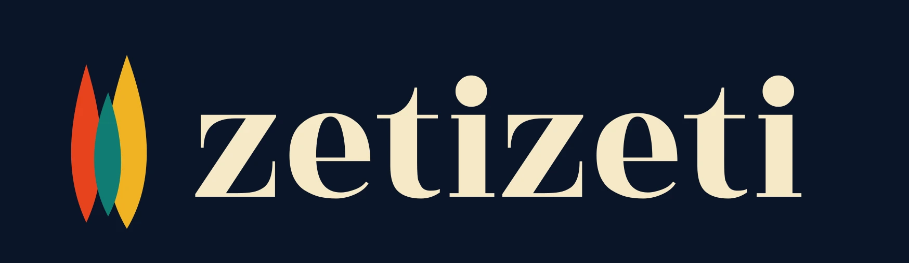
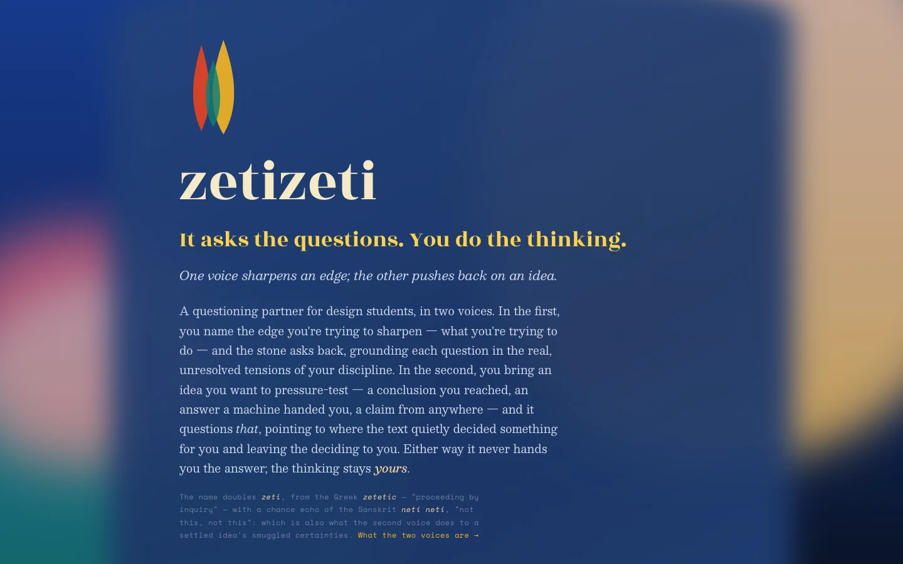

<p align="center">
  
</p>

<h3 align="center">It asks the questions. You do the thinking.</h3>

<p align="center">
  A questioning partner for design students — live at <a href="https://zetizeti.com">zetizeti.com</a>
</p>

<p align="center">
  <a href="https://zetizeti.com"></a>
  <a href="LICENSE"></a>
  <a href="https://github.com/zetizeti/zetizeti/releases"></a>
  
</p>

<p align="center">
  
  
  
  
  
</p>

---

zetizeti is a web Socratic-inquiry toolkit for design students. The interlocutor — *"the stone"* — is a
whetstone: it does not cut for you; it is the thing you draw your own edge against. It asks; it does not
answer. Every architectural decision in this repository exists to enforce one commitment:
**the tool never deposits a conclusion.** What a learner finds for themselves, they keep; what they are
told, they borrow.

<p align="center">
  
</p>

## What it does not do yet

It works for students who stay patient with it and loses the others. That is the bar the versioning ladder calls 1.0. This does not clear it.

201 of the 274 corpus entries are still waiting on a human read; the curtain states this per entry. The method core (Part A) is a single note where it should be many. The reading plan on the criticism surface was measured against the clock it replaced and came back null on question quality: it changes the route, not what gets asked. Until v0.16.0 that surface asked two-box questions, which handed the student a menu instead of a question. It was found because a student said it felt off and could not say why.

## The two voices

**The first voice questions your own thinking.** You name an edge — what you are trying to do, and where
it resists you. The stone asks back, each question grounded in a real, verified tension of your design
discipline, in *your own words* (Clean Language: the tool reuses your exact words and adds none of its
own). It keeps you in the question long enough to think.

**The second voice pushes back on an idea.** Paste in something you want to pressure-test — a conclusion
you reached, an answer a machine handed you, a claim from anywhere. The stone questions *the text*: it
**locates** the places where the text quietly slips from describing into deciding *for* you — a value worn
as a property ("the *clean* interface"), a directive, a verdict relayed as settled — and asks you about
those spots. It never grades the text, never says "this is wrong," never speculates about whether the
text is AI-written. **The tool locates; you judge.**

## How it works — the architecture

The division of labour is fixed and literal: **the AI does language · code does judgement and
tracking · the human decides.** This split has a name — [**Split-Domain Cognition (SDC)**](https://splitdomaincognition.org), a
working principle articulated by zetizeti's author: *language work* (describing, generating,
interpreting) and *judgement work* (deciding, evaluating, concluding) are two unlike kinds of
thinking, and predictable failures appear when one channel is asked to do both — verdicts that can't
be audited, descriptions that quietly smuggle evaluation, models that flatter. zetizeti is that
principle built as software.

```text
Socratic voice
  learner names an edge → exact-word FTS5 retrieval (verified corpus, no embeddings)
  → the model composes ONE question → never-answer guard (deterministic code) → the learner thinks

Critique voice
  student pastes an idea → qualify: segment + tag each piece describing-vs-deciding — the SDC stages (deterministic, NO LLM, every tag carries a why)
  → sensed reading locates the blur (deterministic split-ratio arithmetic, parity-tested)
  → the model phrases ONE question at the located spot → verdict-drift guard (code) → the student judges
```

The two deterministic guards are the product. `validateOutput` rejects any model output that answers,
advises, or concludes; `validateCriticismOutput` extends it to reject any verdict, grade, or
"this-is-AI" claim about a pasted text. They are **code, not model self-assessment** — changing them
changes what the product *is*.

In the critique voice, the *locating* runs with **no model at all**: `lib/qualify.mjs` tags each
segment by readable grammar rules and an editable on-disk lexicon (every flag carries a `why` naming the
exact rule and trigger word), and `lib/sensed.mjs` — a parity-tested port of the
[split-ratio](https://splitdomaincognition.org/split-ratio/) arithmetic — locates where description and
judgement blur. The reading **cannot fail, is reproducible** (same text → same spots, every time), and is
**inspectable by hand**. Where comparable tools ask you to trust a proprietary score, zetizeti's whole
judgement-locating layer can be read, contested, and corrected line by line.

The SSE data-flow contract is implemented in `server.mjs` and `public/index.html`; the
design rationale is in [`docs/concept/architecture.md`](docs/concept/architecture.md); the core commitment in
[`docs/concept/position.md`](docs/concept/position.md).

### What steers a question

Between the retrieval and the guard sits a layer of deterministic steering, and it is the part most
worth reading: **code owns the direction of the question, the model owns its language.** The next
question is built from a word the learner has just introduced; what they keep returning to is treated as
*heat rather than exhaustion* and held while the approach to it moves; the questioning walks the concrete
parts of their idea by **coverage** rather than orbiting the hottest word; a refusal (*"I don't know"*)
changes footing instead of becoming material; a correction (*"that's not what I meant"*) is authoritative;
and one question may hold together two things the learner said far apart and never joined.

None of it characterises the learner. All of it is replayed from the transcript, because nothing is
stored. And the parts that matter are **enforced at the guard**, not requested in a prompt — a lesson
paid for three times over:

> A steering block the model may ignore is not steering — the same shape as *a guard that only reports is
> not a guard*.

Roughly half of what was built here was then measured and removed, and the negative results are kept
rather than deleted. Both are documented in **[`docs/concept/dialogue.md`](docs/concept/dialogue.md)**;
how such a change is judged at all is in
[`docs/concept/evaluation.md`](docs/concept/evaluation.md).

## The corpus, and the verification protocol

The questions are grounded in a **copyright-clean, synthetic, verified corpus** of design tensions —
original prose, each entry backed by citations to real, public scholarship, spanning interaction design,
communication design, product, space, moving image, game design, sustainable fashion, and more. Each
entry carries a `felt as:` register — the plain, oblique ways a student speaks a tension before they know
its name — so "the sign-up feels pushy" reaches the same ground as "dark pattern."

**This is a tool for students, so a fabricated source is the cardinal failure.** Nothing enters the live
corpus as settled grounding until it has passed every gate of the verification protocol — released here
in full:

| Gate | What it checks | Where it is documented |
|---|---|---|
| 1 — Citation authenticity | every cited work exists; author/title/year/venue verified **live** against Crossref and publisher records — never from model memory | [`docs/corpus-build/verification-workflow.md`](docs/corpus-build/verification-workflow.md) |
| 2 — Framing fidelity | what the entry *says* a source argues is true to the source — not a popular misreading | same, + per-entry records |
| 3 — Three independent adversarial passes | factual · logical · philosophical (smuggled-verdict / description-vs-evaluation collapse), plus a copyright-safety gate (ideas re-expressed, never expression reproduced) | [`docs/concept/architecture.md`](docs/concept/architecture.md) §3a |
| 4 — Human sign-off | the maintainer reads the per-entry sign-off sheet and flips `pending → verified`; **no machine ever does this** | [`docs/corpus-build/review-sheets/`](docs/corpus-build/review-sheets/) |

Until all four gates pass, an entry is marked `provenance: pending` and the interface says so: the
behind-the-curtain panel marks every tension **✓ verified** or **◔ pending** — the marker is the honesty.
The per-entry verification records and sign-off sheets are released in [`docs/corpus-build/review-sheets/`](docs/corpus-build/review-sheets/), because an auditable corpus should be auditable all the way down.

## What zetizeti refuses (by design, not omission)

These are load-bearing decisions, documented in [`CONTRIBUTING.md`](CONTRIBUTING.md). They are the product's negative space:

- **No scores, no grades, no verdicts** — a 245-dimension "quality score" is a deposited conclusion
  wearing the clothes of feedback. The tool locates; the human judges.
- **No aggregation** — every reading and every critique is per-instance. Nothing is averaged, ranked,
  benchmarked, or rolled into a profile. Saved, resumable — never compared.
- **No gamification** — no leaderboards, badges, streaks, or percent-complete. Progress is the learner's
  edge getting sharper, private to them.
- **No user modelling** — the tool keeps no model of how you think.
- **No embeddings in retrieval** — Clean Language reuses your *literal* words, so retrieval is exact-word
  FTS5. Semantic search would quietly substitute the tool's reading for yours.
- **No AI-detection** — the critique voice is source-agnostic; it never claims a text "is AI."
- **The pool key is never logged or sent to the client** — the operator's shared OpenRouter key is held
  in memory server-side, used to compose each question, and never written to a log, a response, or disk.

## Running it

**Use it now:** sign in with Google at [zetizeti.com](https://zetizeti.com). Every turn runs on the
operator's shared [OpenRouter](https://openrouter.ai) pool key under hard per-user and lifetime-budget
caps — there is no key to bring and nothing to configure. Access is cohort-gated: an operator may set an
email allowlist, in which case only those signed-in students draw on the pool. The default model is
`google/gemini-3.1-flash-lite` (OpenRouter is only the gateway).

**Local development:**

```bash
npm install
cp .env.example .env          # then edit
npm run dev                   # http://localhost:3000
npm run retrieve-test "I want to make the checkout faster"   # retrieval needs no API key
node --test                   # 61 checks in verification/ — the guards, the parity oracle, the regression locks
```

**Self-hosting:** the app is a single small Node 20 service (Express + SQLite, FTS5 built in) with a
clean [`Dockerfile`](Dockerfile). A school runs it with its own OpenRouter pool key
(`OPENROUTER_API_KEY`) and its own budget caps; the key lives only in memory, never on disk or in the
database. Secrets enter only as environment variables; see the [`Dockerfile`](Dockerfile) and
`captain-definition` for the container shape.

## Documentation map

| | |
|---|---|
| [`docs/concept/position.md`](docs/concept/position.md) | the core commitment — read this first |
| [`docs/concept/dialogue.md`](docs/concept/dialogue.md) | **how a question actually gets made** — every steering mechanism, its evidence, and the half that was rejected |
| [`docs/concept/evaluation.md`](docs/concept/evaluation.md) | how a change to the questioning is judged — the probe, the two axes, four rules learned expensively |
| [`docs/concept/self-hosting.md`](docs/concept/self-hosting.md) | running your own — configuration, access tiers, spend, deployment |
| [`docs/concept/architecture.md`](docs/concept/architecture.md) | the design, incl. the verification system (§3a) and the idea/expression line (§2.1) |
| [`docs/concept/spec.md`](docs/concept/spec.md) | the product spec and its history |
| [`docs/concept/progress-signals.md`](docs/concept/progress-signals.md) | the signals subsystem — signals describe the *inquiry*, never the *inquirer* |
| [`docs/concept/measuring-the-inquiry.md`](docs/concept/measuring-the-inquiry.md) | the second position — the measurement the tool would have to earn to be unique |
| [`docs/corpus-build/`](docs/corpus-build/) | the verification protocol and the per-entry sign-off records |
| [`brand.md`](brand.md) · [`brand/`](brand/) | the visual register and logo assets |

## Contributing

Two lanes — corpus entries and code — described in [`CONTRIBUTING.md`](CONTRIBUTING.md). The short
version: the invariants above are non-negotiable; corpus contributions pass the four verification gates,
and only the maintainer's sign-off makes an entry `verified`; the test suite must stay green. The most
valuable contribution of all: find a text the locator misreads, and tell us why — every miss becomes a
line in a readable lexicon, not a retraining.

## Licence & credits

**AGPL-3.0** — deliberately. The tool can't die (any school can fork and self-host it), and no one,
including its author, can quietly enclose it.

The questioning discipline rests on **Clean Language**, originated by David Grove and codified by Penny
Tompkins & James Lawley. The four *Clean Language Principles* reproduced in the method core are
© 2025 [Leaders in Clean](https://cleanlanguage.com/clean-language-principles/), licensed
[CC BY 4.0](https://creativecommons.org/licenses/by/4.0/), with acknowledgement to David Grove. The felt
sense is described after Eugene Gendlin (texts in copyright, not reproduced).

The name doubles *zeti* — from the Greek *zetetic*, "proceeding by inquiry" — with a chance echo of the
Sanskrit *neti neti*: "not this, not this." Which is also what the second voice does to a settled idea's
smuggled certainties: it subtracts what was decided for you, and never adds a decision of its own.

zetizeti is built and maintained by [Prayas Abhinav](https://prayasabhinav.net).
